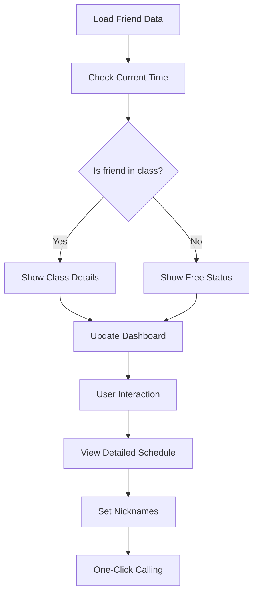

# Clokd - Class Schedule Tracker


**A mobile-first web app for tracking class schedules with friends in real-time**

[](https://github.com/yourusername/clokd/settings/pages)
[](LICENSE)

## Features ✨

- **Real-time Status Tracking**  
  See who's in class or free at a glance with color-coded indicators
- **Detailed Timetable Views**  
  View complete daily schedules with class details
- **Friend Nickname Customization**  
  Personalize friends with custom nicknames
- **Light/Dark Mode**  
  Toggle between themes based on preference or time of day
- **One-Click Calling**  
  Instantly call friends directly from their profile
- **Responsive Design**  
  Optimized for all devices - mobile, tablet, and desktop
- **Smart Status Indicators**  
  Know when friends are in class, on break, or free

## Getting Started 🚀

### Prerequisites
- Modern web browser (Chrome, Firefox, Safari, Edge)
- GitHub account (for deployment)

### Deployment to GitHub Pages
1. Create a new GitHub repository named `clokd`
2. Commit all files to the `main` branch
3. Go to Repository Settings → Pages
4. Set source to "Deploy from a branch"
5. Select branch: `main`, folder: `/ (root)`
6. Save - Your app will be live at:
   `https://<username>.github.io/clokd`

## How It Works 💡

Clokd helps students coordinate with friends by providing real-time visibility into class schedules:



## Security Notes 🔒

- Basic anti-debugging measures implemented
- Context menu and developer tools shortcuts disabled
- For production deployments:
  - Minify and obfuscate JavaScript files
  - Use HTTPS for all connections
  - Implement proper CORS headers

## Technology Stack 🛠️

**Frontend:**
- HTML5
- CSS3 (Flexbox, Grid, Variables)
- JavaScript (ES6+)

**Libraries & Tools:**
- SVG Icons
- localStorage (for theme and alias persistence)
- Google Fonts (Inter)

**Deployment:**
- GitHub Pages

## Project Structure 📁

```
clokd/
├── assets/
│   └── icons/
│       ├── linkedin.svg
│       ├── moon.svg
│       ├── phone.svg
│       └── sun.svg
├── data.js
├── index.html
├── script.js
├── styles.css
└── README.md
```

## Contributing 🤝

We welcome contributions! Here's how to get started:

1. Fork the repository
2. Create your feature branch (`git checkout -b feature/AmazingFeature`)
3. Commit your changes (`git commit -m 'Add some AmazingFeature'`)
4. Push to the branch (`git push origin feature/AmazingFeature`)
5. Open a Pull Request

## License 📄

This project is licensed under the MIT License - see the [LICENSE](LICENSE) file for details.

## Acknowledgments 🙏

- Created by [Ankit Tiwari](https://www.linkedin.com/in/ankit-k-tiwari/)
- Inspired by students' need for better class coordination
- SVG icons from Heroicons and Simple Icons

---

**Get organized, stay connected, and never disturb a friend in class again!**  
[](https://github.com/yourusername/clokd)
